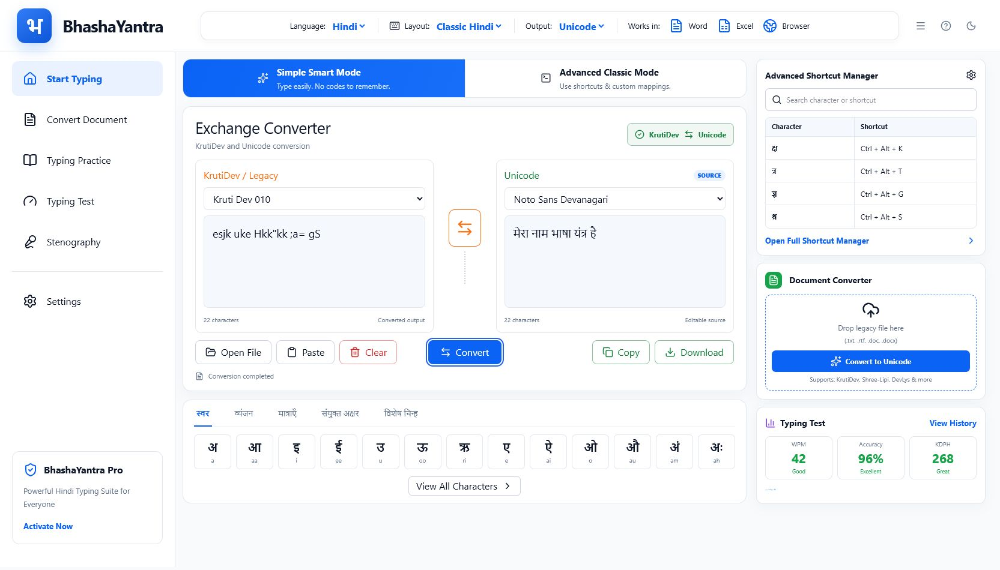

# BhashaYantra

BhashaYantra is a Windows-first Hindi typing, legacy-font conversion, typing-practice, testing, and stenography desktop application.

> Project status: the React/Tauri foundation, final dashboard UI, local bidirectional text converter, Drizzle schema, Supabase migrations, and repository boundaries are implemented. Typing practice, testing, stenography, and complex document conversion remain roadmap modules.



The approved design source is preserved at [docs/assets/bhashayantra-final-reference.png](docs/assets/bhashayantra-final-reference.png).

## Implemented now

- Responsive desktop dashboard matching the approved reference.
- Simple Smart and Advanced Classic mode switch.
- Hindi-first interface with an instant Hindi/English language switch.
- Fully interactive Start Typing pad with the original BhashaYantra Smart Roman-phonetic engine and familiar Classic/KrutiDev keys.
- Working Smart/Classic layout selector, separate offline drafts, and live Unicode or KrutiDev output from either input method.
- Automatic short-i matra, reph, conjunct, and Unicode normalization through the shared typing engine.
- Clickable Classic Hindi on-screen keyboard, Shift layer, word suggestions, and five character-palette groups.
- Searchable full character library and full shortcut manager with direct character insertion.
- Built-in expert shortcuts plus conflict-checked custom shortcuts and physical-key mappings in the working Advanced Classic Manager.
- Offline draft, mode, output, shortcut, and custom-layout persistence.
- Custom layout import/export, reset, text open, output copy, and `.txt` save/download actions.
- Live words, characters, lines, elapsed-session WPM, and mapping-warning feedback.
- Live local KrutiDev 010 ↔ Unicode text conversion in both directions with warnings.
- Text-file open, paste, clear, copy, and download actions.
- Light/dark design tokens and Hindi font fallbacks.
- Character browser, shortcut search, document drop-zone shell, and test summary.
- Drizzle PostgreSQL schema for ten application tables.
- Supabase migrations, Auth ownership constraints, update triggers, and RLS policies.
- Local and Supabase user-preference repository implementations.
- Tauri 2 configuration with allowlisted dialog and text-file permissions.
- Tested Free/Pro/Institution feature-entitlement vocabulary for future secure billing integration.
- Automated converter/typing/licensing tests, strict TypeScript checking, and production frontend build.

## Final product direction

- Default keyboard experience: original BhashaYantra Smart Roman-phonetic input with Unicode output.
- `Simple Smart Mode`: natural Roman Hindi typing with automatic matra and joint-character composition.
- `Advanced Classic Mode`: shortcuts, Alt combinations, custom mappings, and expert controls.
- Central workspace: bidirectional `KrutiDev / Legacy ↔ Unicode` Exchange Converter.
- Additional modules: document conversion, typing practice, typing tests, stenography, shortcut manager, reports, and user customization.

## Approved technology stack

| Area | Technology | Responsibility |
|---|---|---|
| Desktop shell | Tauri 2 | Windows window, native file access, packaging, secure native commands |
| Frontend | React | Screens and interactive UI |
| Language | TypeScript | Typed application, domain, and data-access code |
| Styling | Tailwind CSS | Design tokens and utility styling |
| UI components | shadcn/ui | Accessible, project-owned component source |
| Database schema | Drizzle ORM + Drizzle Kit | TypeScript schema and generated migrations |
| Cloud platform | Supabase | PostgreSQL, Auth, Storage, Row Level Security, and optional sync |

No additional application framework is part of the approved base stack. Small supporting packages required by these tools may be installed during implementation.

## Documentation

Start with [Documentation Index](docs/00-documentation-index.md).

- [Product Specification](docs/01-product-spec.md)
- [System Architecture](docs/02-system-architecture.md)
- [Database ERD](docs/03-database-erd.md)
- [Repository Pattern](docs/04-repositories.md)
- [Business Logic](docs/05-business-logic.md)
- [Frontend Design System](docs/06-frontend-design-system.md)
- [Development Roadmap](docs/07-development-roadmap.md)
- [Implementation Status](docs/08-implementation-status.md)
- [Business Model](docs/09-business-model.md)

## Download

Local Windows packages produced from this source tree:

| Download type | Location |
|---|---|
| Setup executable | [BhashaYantra_0.1.0_x64-setup.exe](src-tauri/target/release/bundle/nsis/BhashaYantra_0.1.0_x64-setup.exe) |
| MSI installer | [BhashaYantra_0.1.0_x64_en-US.msi](src-tauri/target/release/bundle/msi/BhashaYantra_0.1.0_x64_en-US.msi) |
| Portable build output | [bhashayantra.exe](src-tauri/target/release/bhashayantra.exe) |

These local packages are unsigned development builds. Before public distribution, add Windows code signing and publish the source and signed installers to the project's repository release page.

### Download from GitHub Actions

The repository includes [`.github/workflows/build.yml`](.github/workflows/build.yml). After the project is pushed to GitHub, every push to `main`, pull request, or manual workflow run will:

1. Install the locked Node.js and Rust dependencies on a Windows runner.
2. Run the TypeScript check and converter tests.
3. Build the Tauri portable executable, MSI, and Setup executable.
4. Store them for 14 days in the workflow run under **Artifacts → BhashaYantra-Windows**.

The repository is private and in active development. Do not create a public GitHub Release or version tag yet. When all release gates are complete, the maintainer can intentionally create a version tag:

```powershell
git tag v0.1.0
git push origin v0.1.0
```

Only that future version-tag workflow will create a release and attach all three Windows downloads:

| Published item | URL |
|---|---|
| Source repository | [github.com/Isopleth-Labs/BhashaYantra](https://github.com/Isopleth-Labs/BhashaYantra) |
| Future release downloads | [Releases](https://github.com/Isopleth-Labs/BhashaYantra/releases) |

Developer source download after publication:

```powershell
git clone https://github.com/Isopleth-Labs/BhashaYantra.git
cd BhashaYantra
```

After production release, end users will not need Node.js, Rust, or Docker. Until then, installers remain private development artifacts.

## Development prerequisites

Windows development requires:

1. Git.
2. Current Node.js LTS and npm.
3. Rust stable with the MSVC toolchain.
4. Microsoft C++ Build Tools and WebView2 required by Tauri.
5. Docker Desktop or another Docker-compatible runtime for local Supabase.

Official setup references:

- [Tauri prerequisites](https://v2.tauri.app/start/prerequisites/)
- [Tauri project creation](https://v2.tauri.app/start/create-project/)
- [Supabase local development](https://supabase.com/docs/guides/local-development)
- [Drizzle Kit overview](https://orm.drizzle.team/docs/kit-overview)
- [Tailwind CSS with Vite](https://tailwindcss.com/docs/installation/using-vite)
- [shadcn/ui with Vite](https://ui.shadcn.com/docs/installation/vite)

## First-time setup

After cloning the repository:

```powershell
npm install
Copy-Item .env.example .env.local
npm run dev
```

For the full desktop window, install the Tauri Windows prerequisites and run `npm run tauri dev`.

For local Supabase, start Docker Desktop and run `npx supabase start`. Supabase is optional for the local converter and dashboard.

## Environment variables

The desktop frontend may receive only public Supabase configuration:

```dotenv
VITE_SUPABASE_URL=
VITE_SUPABASE_PUBLISHABLE_KEY=
```

Database credentials are for migration tooling or trusted backend environments only:

```dotenv
DATABASE_URL=
```

Never expose `DATABASE_URL`, a service-role key, or any other server secret through a `VITE_` variable or bundle it into the Tauri application.

## Development commands

```powershell
# Install dependencies
npm install

# Start local Supabase services
npx supabase start

# Run the browser UI during frontend-only work
npm run dev

# Run the complete Tauri desktop app
npm run tauri dev

# Generate SQL from the Drizzle schema
npm run db:generate

# Rebuild the local Supabase database from migrations and seed data
npm run db:reset

# Run converter unit tests and database security tests
npm run test
npm run db:test

# Create a production frontend build
npm run build

# Create Windows installers
npm run tauri build
```

The first Tauri build can take longer because Rust dependencies must be downloaded and compiled.

## Verified build status

The current workspace has passed strict TypeScript checking, eleven converter/typing unit tests, eight database/RLS tests, Drizzle configuration validation, Supabase schema linting, Rust formatting and Clippy checks, frontend production build, browser interaction QA, desktop executable build, and both Windows installer builds.

## Database workflow

1. Drizzle TypeScript schema is the application schema source of truth.
2. Drizzle Kit generates timestamped SQL into `supabase/migrations/`.
3. Supabase CLI applies migrations locally with `supabase db reset` and remotely with `supabase db push`.
4. Production changes always use reviewed migration files; direct dashboard schema edits are not the normal workflow.

## Security baseline

- Supabase Row Level Security is enabled on every user-owned table.
- Desktop code uses only the Supabase publishable key.
- Secret keys and direct database credentials remain outside the desktop bundle.
- File conversion is local by default; user documents are not uploaded unless the user explicitly enables a cloud feature.
- Tauri capabilities grant only the native permissions required by each feature.

## License

No license has been selected yet. Add a `LICENSE` file before public distribution.
