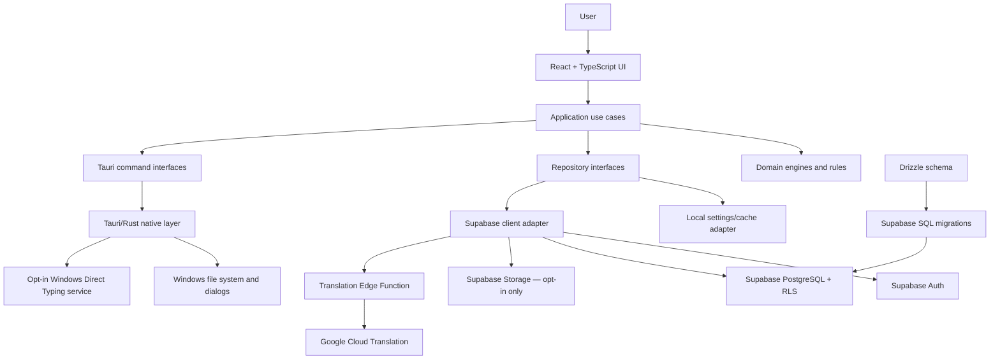
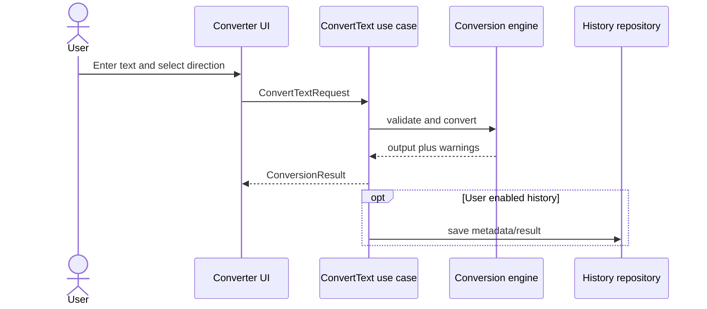
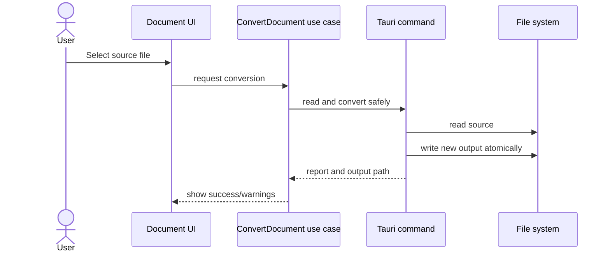
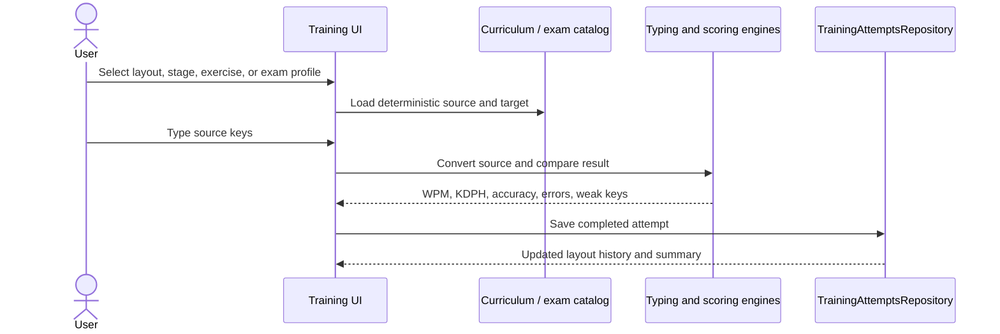

# System Architecture

## 1. Architecture goals

- Keep typing and conversion responsive and usable offline.
- Separate UI, business rules, data access, and native capabilities.
- Make conversion and scoring deterministic and testable.
- Use Supabase safely without embedding privileged credentials.
- Allow future language packs without rewriting the application.

## 2. High-level architecture



### 2.1 Multi-layout engine boundaries

The engine keeps five concerns independent so a product label cannot accidentally select the wrong behavior:

| Concern | Typed examples | Runtime responsibility |
|---|---|---|
| Interface language | Hindi, English | UI translations only |
| Typing language | Hindi, English | Filters valid keyboard layouts and output choices |
| Keyboard layout | BhashaYantra Smart, Classic Hindi, INSCRIPT, English QWERTY | Converts physical/source keys into Unicode |
| Legacy encoding profile | Kruti Dev 010, DevLys 010, Shree-Lipi | Converts stored legacy glyph codes to/from Unicode |
| Unicode display font | Noto Sans Devanagari, Mangal, Nirmala UI, Segoe UI | Changes preview rendering without changing text |

Profile registries include a readiness state. Only `ready` profiles reach an executable engine; `validation` profiles remain disabled until their fixture corpus passes. The same layout ID flows through typing, custom mappings, starter lessons, tests, and future document conversion.

## 3. Layer responsibilities

### Presentation layer

Technology: React, TypeScript, Tailwind CSS, shadcn/ui.

- Renders screens and components.
- Collects user input and displays state.
- Contains no Supabase queries, font-conversion algorithms, or scoring formulas.
- Calls typed application use cases.

### Application layer

- Coordinates workflows such as convert text, save layout, and finish test.
- Applies authorization and orchestration rules.
- Uses repository and native-command interfaces.
- Converts infrastructure errors into application errors.

### Domain layer

- Legacy/Unicode mapping rules.
- Unicode composition and normalization.
- Keyboard mapping and shortcut resolution.
- Typing-test scoring.
- Stenography session rules.
- Contains pure TypeScript wherever possible and does not depend on React or Supabase.

### Repository layer

- Defines domain-focused persistence interfaces.
- Supabase implementations translate between database rows and domain models.
- Local implementations support offline settings and cached data.
- React components never import a concrete repository.

### Native layer

Technology: Tauri 2 and its Rust project under `src-tauri/`.

- Native open/save dialogs.
- Safe file reads and atomic writes.
- Document parsing/conversion capabilities that require native access.
- OS integration and packaging.
- Explicitly enabled per-keystroke Direct Typing for standard Windows applications.
- Exposes a small allowlisted command surface to the webview.

The current **Direct Typing** development bridge uses dedicated keyboard/focus-hook and composition threads. Physical printable keys are suppressed once, transformed with the selected in-memory layout profile, and injected once at the target caret. Its Office-safe render delta finds the unchanged Unicode prefix and edits only the changed suffix; it does not rely on Word's language-dependent whole-word selection. Injected events, BhashaYantra's own process, and Ctrl/Alt/Win shortcuts are excluded. Mouse clicks and navigation reset the transient word buffer; `Ctrl + Alt + F12` is the unconditional emergency-off path. No captured source text is persisted or uploaded.

This bridge is not represented as the final Windows IME. `SendInput` is limited by Windows integrity isolation, and low-level hooks require the BhashaYantra process to remain running. A production system keyboard must use a digitally signed Text Services Framework component with its own installation and security review.

### Cloud and database layer

- Supabase Auth identifies users.
- Account signup metadata may request only the allowlisted `student` or `institute` role. The database trigger normalizes that value into `profiles.account_role`; every login reloads the server profile and rejects a mismatched workspace.
- Offline product tools remain usable without an account, but Student and Institute dashboards have no local authentication bypass.
- PostgreSQL stores user-owned metadata, settings, layouts, and result history.
- Row Level Security enforces ownership.
- Storage is used only for explicitly uploaded content.
- Drizzle defines the application schema and generates reviewed SQL migrations.
- The optional `translate-text` Edge Function keeps the Google Cloud Translation credential server-side and accepts only allowlisted language pairs and bounded text.
- A provider port also supports a local LibreTranslate server. Its URL is validated, remote endpoints require HTTPS, optional keys remain session-only, and returned text must pass provider-identity, unchanged-output, and target-script checks.

## 4. Security boundary

The Tauri application is distributed to end users and must be treated as an untrusted client.

- Allowed in desktop bundle: Supabase URL and publishable key.
- Forbidden in desktop bundle: service-role key, direct database password, `DATABASE_URL`, signing secrets.
- User data access must succeed only through authenticated Supabase requests covered by RLS.
- Privileged administration belongs in a trusted backend or Supabase-managed function, not in React.

## 5. Planned repository structure

```text
BhashaYantra/
├── README.md
├── docs/
├── package.json
├── vite.config.ts
├── drizzle.config.ts
├── src/
│   ├── app/
│   │   ├── providers/
│   │   ├── routes/
│   │   └── shell/
│   ├── features/
│   │   ├── converter/
│   │   ├── typing/
│   │   ├── practice/
│   │   ├── tests/
│   │   ├── stenography/
│   │   ├── shortcuts/
│   │   └── settings/
│   ├── domain/
│   │   ├── conversion/
│   │   ├── keyboard/
│   │   ├── scoring/
│   │   └── stenography/
│   ├── application/
│   │   ├── ports/
│   │   └── use-cases/
│   ├── data/
│   │   ├── repositories/
│   │   ├── supabase/
│   │   └── local/
│   ├── db/
│   │   └── schema/
│   ├── components/
│   │   └── ui/
│   ├── styles/
│   └── shared/
├── src-tauri/
│   ├── capabilities/
│   └── src/
│       ├── commands/
│       └── services/
├── supabase/
│   ├── config.toml
│   ├── migrations/
│   ├── seed.sql
│   └── tests/
└── tests/
```

## 6. Primary data flows

### Text conversion



### Document conversion



### Practice and exam attempts



The curriculum catalog and scoring engine are domain modules and do not import React or browser storage. The UI depends on the `TrainingAttemptsRepository` port; the current adapter uses versioned local storage and can later be composed with a Supabase adapter.

## 7. Local-first behavior

- Conversion rules and keyboard profiles ship with the application.
- Anonymous users can type, convert text, complete the full locally shipped curriculum, run exam simulations, and review local attempt history offline.
- Local settings are authoritative while offline.
- Cloud sync is optional and reconciles only syncable records.
- Source documents do not enter the sync queue.

## 8. Migration ownership

Drizzle and Supabase have separate, explicit roles:

1. Drizzle schema files define tables and relations in TypeScript.
2. Drizzle Kit generates SQL using Supabase-compatible timestamp prefixes.
3. Generated SQL is stored under `supabase/migrations/` and reviewed.
4. Supabase CLI applies and verifies migrations locally and remotely.
5. Only one migration history workflow is used in production to avoid split ownership.

## 9. Architecture decisions

| Decision | Reason |
|---|---|
| Tauri rather than a browser-only app | Native Windows packaging and controlled file access |
| React SPA inside Tauri | Tauri recommends static SPA-style frontends and the approved stack uses React |
| Domain logic independent of React | Deterministic tests and reuse across UI/native workflows |
| Supabase client behind repositories | Prevent infrastructure details from spreading into UI and business logic |
| Drizzle for schema, Supabase CLI for applying migrations | Typed schema with one reviewed deployment path |
| RLS on all user-owned tables | Desktop clients cannot protect server data by hiding credentials |
| Local conversion by default | Privacy, speed, and offline operation |

## 10. Official references

- [Tauri project structure](https://v2.tauri.app/start/project-structure/)
- [Tauri frontend configuration](https://v2.tauri.app/start/frontend/)
- [Tauri architecture](https://v2.tauri.app/concept/architecture/)
- [Drizzle schema](https://orm.drizzle.team/docs/sql-schema-declaration)
- [Supabase local workflow](https://supabase.com/docs/guides/local-development/cli-workflows)
