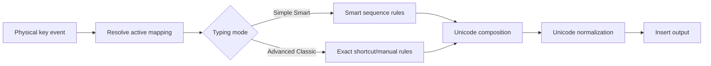
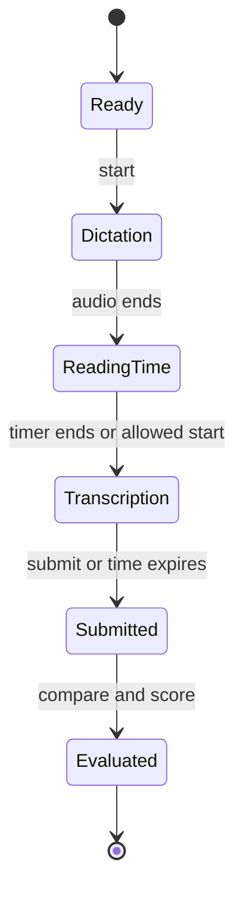

# Business Logic

## 1. Domain boundaries

Business logic is organized into four independent domains:

1. Keyboard input and Unicode composition.
2. Legacy/Unicode conversion.
3. Typing practice and scoring.
4. Stenography sessions and evaluation.

The domain layer is pure TypeScript wherever native file handling is not required.

## 2. Core domain types

```ts
type TypingMode = "simple-smart" | "advanced-classic";
type OutputMode = "unicode" | "legacy";
type ConversionDirection = "legacy-to-unicode" | "unicode-to-legacy";
type Modifier = "shift" | "ctrl" | "alt" | "alt-graph";

interface KeyStroke {
  code: string;
  modifiers: ReadonlySet<Modifier>;
  timestamp: number;
}

interface ConversionResult {
  output: string;
  warnings: ConversionWarning[];
  inputCharacters: number;
  outputCharacters: number;
}
```

Branded IDs and validated value objects are used for layout IDs, Unicode sequences, shortcut signatures, and scoring profiles.

## 3. Keyboard processing pipeline



### Simple Smart Mode rules

- Apply the selected Classic Hindi mapping.
- Resolve common intended joint characters.
- Reorder pre-base and post-base matras correctly.
- Handle halant, reph, and half-letter sequences.
- Reject impossible internal states without losing user input.
- Offer suggestions without silently replacing text when confidence is low.

### Advanced Classic Mode rules

- Resolve the most specific enabled shortcut first.
- Preserve explicit manual sequences.
- Report conflicting shortcuts at configuration time.
- Do not apply a smart correction that changes an explicitly mapped output.

## 4. Exchange Converter pipeline

```text
Validate request
    ↓
Select source and target profiles
    ↓
Tokenize using longest valid source sequence
    ↓
Map legacy sequences to logical Unicode units (or reverse)
    ↓
Apply matra, reph, halant, and joint-letter ordering
    ↓
Normalize Unicode output where applicable
    ↓
Collect ambiguous/unsupported-character warnings
    ↓
Return output without mutating the source
```

### Conversion rules

- Mapping data is versioned and testable.
- Longest-match tokenization prevents short mappings from consuming larger valid sequences.
- Unknown characters pass through only when the selected profile permits it; otherwise they produce warnings.
- Line endings and paragraph boundaries are preserved.
- Reverse conversion may be lossy; the result must identify warnings instead of claiming perfect round-trip fidelity.
- History is saved only after explicit user consent/settings.

## 5. Document conversion rules

1. Validate extension, size, and readable path.
2. Open the document without modifying the source.
3. Extract supported text runs while retaining their structural location.
4. Convert only runs associated with the selected source profile.
5. Generate a new output document.
6. Write to a temporary sibling file and then finalize atomically.
7. Return output path, converted-run count, skipped-run count, and warnings.

The UI cannot pass an arbitrary unrestricted file-system operation to Tauri. Native commands accept validated, narrowly scoped inputs.

## 6. Keyboard layout rules

- `BhashaYantra Smart` tokenizes Roman words with longest-match consonant/vowel rules, composes dependent matras and conjuncts, then applies a versioned original word dictionary.
- Smart input preserves Devanagari and punctuation, so palette insertion and mixed text remain safe.
- Smart, Classic, INSCRIPT, and English QWERTY source drafts are stored independently; changing a layout never reinterprets or destroys another layout's source.
- Typing language, keyboard layout, legacy encoding profile, Unicode display font, and interface language are separate typed concepts and must never share one dropdown value.
- Ready profiles are executable. Validation-pending profiles remain visible for roadmap clarity but disabled until a licensed acceptance corpus passes.
- DevLys and Shree-Lipi are conversion profiles, not keyboard layouts. Mangal, Noto Sans Devanagari, and Nirmala UI are display fonts, not encodings.
- Custom shortcuts and physical-key mappings belong to one layout ID; importing a layout file cannot overwrite another layout's custom layer.
- Built-in layout: immutable.
- User customization: clone, then edit.
- Mapping identity: physical key plus canonical modifier signature.
- Shortcut identity: canonical sorted modifier signature plus key/code.
- Empty output is allowed only when explicitly configured as a disabled key.
- Imports are validated for schema version, language, duplicates, and unsafe content.

## 7. Typing scoring

Raw measurements are stored before derived scores:

- elapsed milliseconds;
- total and correct keystrokes;
- submitted grapheme clusters;
- expected grapheme clusters;
- missing, extra, substituted, and transposed units;
- backspace count;
- applied scoring-profile version.

Default display formulas:

```text
Gross WPM = total typed characters / 5 / elapsed minutes
KDPH      = total key depressions / elapsed hours
Accuracy  = correct comparison units / total comparison units × 100
Net WPM   = scoring-profile-specific deduction from Gross WPM
```

Exam-specific full/half-mistake rules must be stored in a versioned scoring profile. The result screen shows which profile was used.

Comparison uses Unicode normalization and grapheme-aware segmentation so a visually equivalent character sequence is not incorrectly penalized merely because of code-point composition.

### Curriculum catalog version 1

- Ready layouts: BhashaYantra Smart, Classic Hindi/KrutiDev, Devanagari INSCRIPT, and English QWERTY.
- Each layout has 60 key drills, 90 word drills, 90 sentence drills, and 60 paragraph drills.
- Canonical Hindi targets are generated through the BhashaYantra Smart engine; Classic and INSCRIPT source keys are obtained through deterministic inverse mappings and then round-trip validated.
- Every exercise has a stable ID, sequence, focus keys, difficulty, estimated duration, tier, and conversion-warning count.
- Professional metadata also records phase, module position, competency, practice mode, drill blocks, mastery accuracy, required clean passes, recommended WPM, word count, and character count.
- Key training advances through Precision, Alternation, and Fluency Review. Each lesson contains four purposeful drill blocks. Word lessons reject duplicate terms and contain Recognition, Recall, and Timed Set blocks; sentence and paragraph lessons enforce minimum depth.
- A lesson is mastered only after its saved clean-run count reaches the lesson requirement. Access is independent of mastery, so every stage and lesson remains selectable.
- KrutiDev short-i reordering keeps the matra after the full consonant cluster, including forms such as `स्थिरता`, `पंक्ति`, `प्रविष्टि`, and `प्रक्रिया`.
- The content is original project material. Competitor exercises, logos, and proprietary exam screens are not copied.

### Current attempt analysis

- Positional comparison reports correct, missing, extra, and substituted characters.
- Correct WPM uses correct characters divided by five per elapsed minute; gross WPM uses all typed characters; KDPH uses correct key depressions per elapsed hour.
- CPCT-style NWPM uses correctly matched words per elapsed minute and is evaluated independently of arbitrary accuracy thresholds.
- Weak-key analysis ranks expected source keys that were missing or substituted.
- Completed practice and submitted/expired tests are persisted once with an immutable attempt ID and timestamp.
- Recruitment-specific full/half-mistake deduction formulas that are not yet independently validated remain a later scoring-profile version; the current profile never invents such deductions.

### Mock-exam workstation state

```text
Ready → Running ↔ Paused → Submitted
                  Running → Expired
Submitted/Expired → Ready (new paper)
```

- The timer starts only from the explicit Start command, not from the first typed key.
- Profile, duration, paper, word limit, highlighting, scrolling, correction, and custom-passage settings lock when the exam starts.
- Official-reference duration and correction policy lock before the exam. Pause is unavailable during official-reference runs.
- A profile with a verified layout/font requirement cannot start in a mismatched environment.
- Pause freezes elapsed time and disables typing; Resume continues from the accumulated elapsed time.
- Submit and timeout both create one immutable test attempt; completing the visible passage early does not silently finish the exam.
- Passage rendering supports current-word, word-error, letter, and no-highlight modes without changing the scoring text.
- Clearing mock-test history cannot delete practice-course attempts, and clearing practice history cannot delete test attempts.

## 8. Stenography state machine



The selected session profile controls audio speed, pause/seek permissions, reading duration, transcription duration, and scoring. Desktop narration first uses the narrowly allowlisted Windows speech command and falls back to a chunked browser queue in web preview. The user can test the voice before committing to a timed session.

Two interaction contracts are intentionally separate:

- `exam-simulation`: the transcript remains disabled through countdown and dictation, then opens for the selected transcription duration.
- `listen-type`: the transcript opens when dictation starts so the learner can practise office-style live transcription; this mode is clearly labelled training and does not claim to reproduce an official shorthand phase.

## 9. Initial application use cases

- `SwitchTypingMode`
- `ProcessKeyStroke`
- `CloneKeyboardLayout`
- `SaveKeyMapping`
- `SaveCustomShortcut`
- `ConvertText`
- `ConvertDocument`
- `StartPracticeAttempt`
- `SubmitPracticeAttempt`
- `StartStenographySession`
- `SubmitStenographyTranscript`
- `UpdateUserPreferences`
- `SyncUserConfiguration`

Each use case accepts a typed request and returns a typed success or application error. It never depends on a React component.

## 10. Test corpus

Before implementation is considered correct, create fixtures for:

- independent vowels and dependent matras;
- half letters and halant sequences;
- reph before/after relevant clusters;
- `क्ष`, `त्र`, `ज्ञ`, `श्र`, and representative conjuncts;
- punctuation, numbers, Latin text, and mixed-script passages;
- malformed legacy sequences;
- round-trip cases marked lossless or intentionally lossy;
- Unicode normalization variants;
- shortcut conflicts and mapping precedence;
- exam scoring examples with manually verified expected results.
